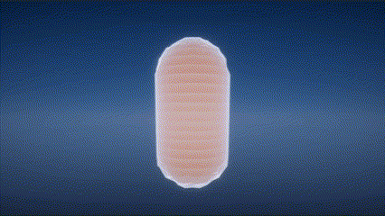

# HologramShader
 Hologram shaders for Unity

 This repository contains a collection of hologram shaders in Unity. Shaders created for Unity 2022.3.6f1 using Shader Graph.

## Included Shaders
- Default hologram shader (Without glitching): `Hologram.shader`,
- Glitchy hologram shader: `GlitchyHologram.shader`,

 ## Showcase
|Style|Image|
|:--:|:--:|
|Default Hologram | |
|Glitchy Hologram  | |

## Settings
This project created using Universal Render Pipeline.
